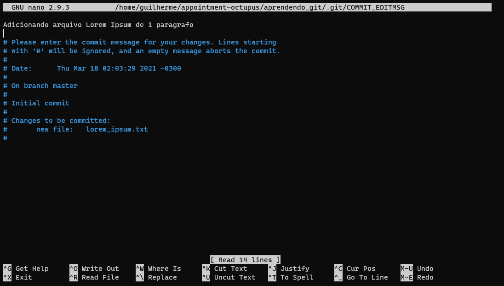
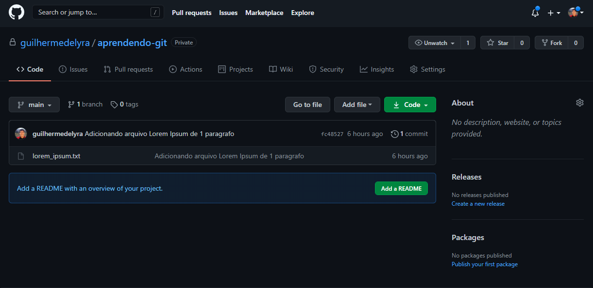
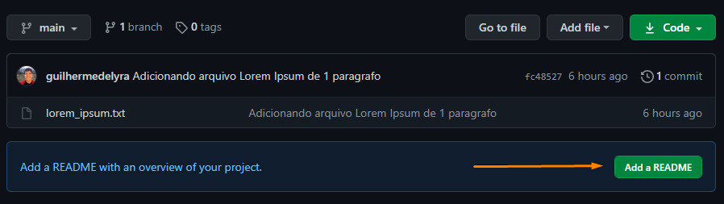
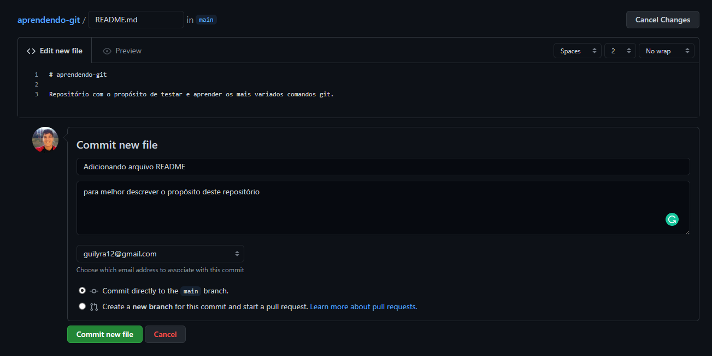
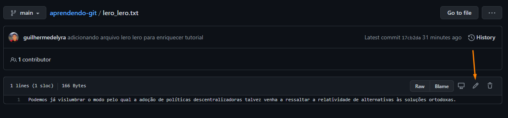
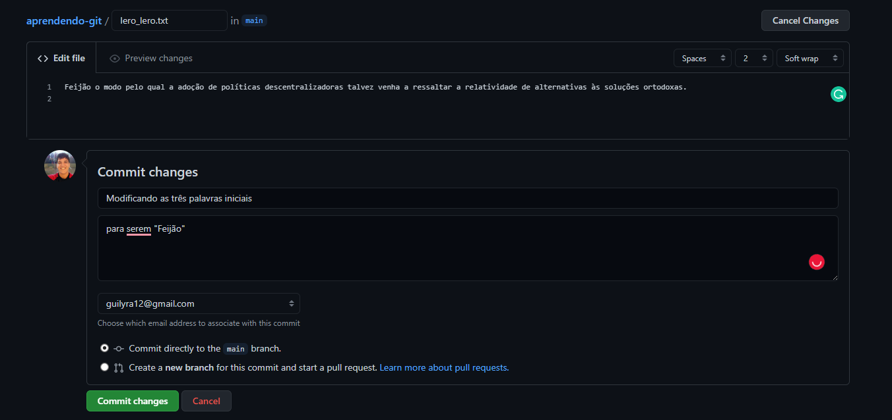
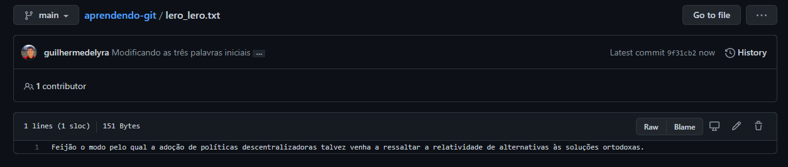
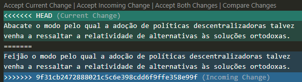
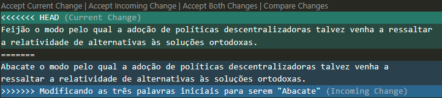

# Principais comandos

Bom, enfim vamos trabalhar com um exemplo do zero.

O que você verá nesse capítulo:

- [Principais comandos](#principais-comandos)
    - [Git init](#git-init)
      - [Extra](#extra)
    - [Git status](#git-status)
    - [Git add](#git-add)
    - [Git commit](#git-commit)
    - [Git log/reflog](#git-logreflog)
    - [Git commit --amend](#git-commit---amend)
      - [message](#message)
      - [no-edit](#no-edit)
      - [Boas praticas](#boas-praticas)
    - [Git reset/restore](#git-resetrestore)
    - [Git remote](#git-remote)
    - [Git branch](#git-branch)
    - [Git push](#git-push)
    - [README.md](#readmemd)
    - [Criando mais um arquivo](#criando-mais-um-arquivo)
    - [Git pull](#git-pull)
    - [Git merge](#git-merge)
    - [Modificando arquivo remotamente e localmente, simultaneamente](#modificando-arquivo-remotamente-e-localmente-simultaneamente)
      - [No repositorio local](#no-repositorio-local)
      - [No repositório remoto](#no-repositório-remoto)
      - [Resolvendo conflitos](#resolvendo-conflitos)
        - [Merge:](#merge)
        - [Rebase:](#rebase)

### Git init

Para este tutorial, crie uma pasta para que possa acompanhar esse tutorial de forma mais interativa:

```bash
$ mkdir aprendendo_git
```

```bash
$ cd aprendendo_git
```

Para versionar uma pasta/diretório, é preciso iniciar um repositório. A partir da pasta raíz do seu projeto, execute:

```bash
$ git init
Initialized empty Git repository in <caminho_até_diretório>/aprendendo_git/.git/
```

Após isso, liste os arquivos neste diretório:

```bash
$ ls -a
. .. .git
```

> a flag `-a` significa: "do not ignore entries starting with `.`"

O **Git** criou uma pasta chamada `.git`. Essa pasta contém os metadados que o git necessita para operar naquele repositório.

#### Extra

Sinta-se, obviamente, a vontade para explorar essa pasta :)

```bash
$ sudo apt install tree
```

```bash
$ tree .git
.git
├── branches
├── config
├── description
├── HEAD
├── hooks
│   ├── applypatch-msg.sample
│   ├── commit-msg.sample
│   ├── fsmonitor-watchman.sample
│   ├── post-update.sample
│   ├── pre-applypatch.sample
│   ├── pre-commit.sample
│   ├── pre-merge-commit.sample
│   ├── prepare-commit-msg.sample
│   ├── pre-push.sample
│   ├── pre-rebase.sample
│   ├── pre-receive.sample
│   └── update.sample
├── info
│   └── exclude
├── objects
│   ├── info
│   └── pack
└── refs
    ├── heads
    └── tags

9 directories, 16 files
```

### Git status

Sempre que você estiver nesse repositório, terá acesso a versão mais atual do projeto. Utilizando o comando `git status`, pode aferir quais foram as ultimas mudanças em relação ao ultimo commit (traduzindo: a ultima versão "salva" do projeto)

Como não adicionamos nenhum arquivo, caso rode este comando terá o seguinte output:

```bash
$ git status
On branch master

No commits yet

nothing to commit (create/copy files and use "git add" to track)
```

> hoje em dia há um movimento para que a branch padrão se chame `main` em vez de `master`, então não se surpreenda caso o seu output tenha sido diferente

Ou seja, não há nada para adicionar (e depois commitar), assim como não há uma versão anterior para se comparar com a versão atual da pasta

### Git add

Crie um arquivo `lorem_ipsum.txt`:

```bash
$ echo "Lorem ipsum dolor sit amet, consectetur adipiscing elit. Mauris malesuada augue vel quam dignissim, nec egestas nisl pretium. Integer porttitor eleifend turpis non ullamcorper. Maecenas maximus sit amet ipsum et facilisis. Aenean tincidunt urna a ex consequat venenatis. Curabitur eget ante scelerisque tellus efficitur pulvinar ac quis lorem. Donec imperdiet ligula id tortor viverra, imperdiet consequat est suscipit. Donec congue pellentesque velit eget rhoncus. Vestibulum bibendum erat sem, sed maximus ipsum condimentum et. Vivamus lectus justo, hendrerit ac ornare eget, ultrices ut massa. Sed euismod, magna vitae ultrices aliquam, est quam volutpat mauris, id fringilla mauris sem ut diam. Mauris laoreet efficitur urna at tempor. Nulla scelerisque iaculis ligula et consequat. Nulla in viverra nunc. Nunc nibh neque, ornare ut magna sed, tempor egestas ligula. Quisque iaculis justo ut diam mattis, vitae iaculis eros luctus." > lorem_ipsum.txt
```

Verifique que o mesmo foi criado:

```bash
$ ls
lorem_ipsum.txt
```

Entretanto, o mesmo ainda não está sendo rastreado pelo Git:

```bash
$ git status
On branch master

No commits yet

Untracked files:
  (use "git add <file>..." to include in what will be committed)
	lorem_ipsum.txt

nothing added to commit but untracked files present (use "git add" to track)
```

Perceba que o próprio git nos dá dicas. Adicione o arquivo a zona de "staging": uma pre-seleção do que deverá, de fato, ser versionado/commitado.

```bash
$ git add lorem_ipsum.txt
```

> O arquivo não foi adicionado, ainda, ao repositório do git. A zona de staging é um intermediário entre o Local e o Repositório.

O status mudou:

```bash
$ git status
On branch master

No commits yet

Changes to be committed:
  (use "git rm --cached <file>..." to unstage)
	new file:   lorem_ipsum.txt
```

### Git commit

Vamos, então, commitar o arquivo: ou seja, adicionar ao repositório do git para que o mesmo comece a ser versionado.

```bash
$ git commit -m "Adiçionando arquivo Lorem Ipsum de 1 paragrafo"
```

O status, novamente, mudou:

```bash
$ git status
On branch master
nothing to commit, working tree clean
```

### Git log/reflog

Para verificar quais commits já fizera, basta rodar o comando `log`:

```bash
$ git log
commit 0e1027f301d18c72e37a755775e8c189a79823e3 (HEAD -> master)
Author: Seu Nome <seu@email.com>
Date:   Thu Mar 18 02:03:29 2021 -0300

    Adiçionando arquivo Lorem Ipsum de 1 paragrafo
```

Perceba que é informado qual o "id"/hash desse commit (`0e1027f301d18c72e37a755775e8c189a79823e3`), o autor do commit, data e a mensagem inserida -- todas as informações necessárias para rastrear esse versionamento do repositório.

Se utilizar `reflog`, terá um log mais enxuto (com hashs encurtecidas também):

```bash
$ git reflog
0e1027f (HEAD -> master) HEAD@{0}: commit (initial): Adicionando arquivo Lorem Ipsum de 1 paragrafo
```

> Note que o início de ambas as hashs são iguais

O log têm inumeras utilidades que serão abordadas no próximo capítulo :)

### Git commit --amend

Como pôde perceber, há um erro ortográfico na mensagem do commit: escrevemos "Adi**ç**ionando" em vez de "Adi**c**ionando". Podemos alterá-la utilizando o comando `--amend`:

```bash
$ git commit --amend
```



Este editor pode parecer estranho a primeira vista. Se chama [`nano`](https://www.nano-editor.org), e vem como editor de texto padrão no terminal do Linux.

Após fazer a alteração necessária, basta apertar `Ctrl+O` e `[Enter]` para salvar a alteração no commit, e `Ctrl+X` para retornar ao terminal.

Vale ressaltar que esse comando vale não somente para a mensagem do commit como, também, para os arquivos. Bastaria modificar o que fosse conveniente, utilizar `git add` e então `git commit --amend`.

#### message

Além disso, caso queira evitar utilizar o [`nano`](https://www.nano-editor.org), basta incluir a flag `-m`:

A titulo de exemplo, vamos criar o arquivo `backup-lorem_ipsum.txt`:

```bash
$ cp lorem_ipsum.txt backup-lorem_ipsum.txt
```

Status:

```bash
$ git status
On branch master
Untracked files:
  (use "git add <file>..." to include in what will be committed)

        backup-lorem_ipsum.txt

nothing added to commit but untracked files present (use "git add" to track)
```

Adicionando-o:

```bash
$ git add backup-lorem_ipsum.txt
```

Commitando:

```bash
$ git commit --amend -m "Adicionando arquivo Lorem Ipsum de 1 paragrafo e, também, arquivo de backup"
[master 6e3bfef] Adicionando arquivo Lorem Ipsum de 1 paragrafo e, também, arquivo de backup
 Date: Thu Mar 18 02:03:29 2021 -0300
 2 files changed, 2 insertions(+)
 create mode 100644 backup-lorem_ipsum.txt
 create mode 100644 lorem_ipsum.txt
```

Log:

```bash
$ git log
commit 6e3bfef34d498057d67454c88188885dd82bec7f (HEAD -> master)
Author: Seu Nome <seu@email.com>
Date:   Thu Mar 18 02:03:29 2021 -0300

    Adicionando arquivo Lorem Ipsum de 1 paragrafo e, também, arquivo de backup
```

#### no-edit

Acaso queira modificar só os arquivos (e, não, a mensagem do commit), basta incluir a flag `--no-edit`.

#### Boas praticas

É interessante que só se faça isso em commits locais, haja vista que o commit "amendado" é outro commit, distinto do que fora utilizado como base. Isso significa que, caso este seja um commit publico, ao "adulterá-lo", tende a gerar uma inconveniência para outros desenvolvedores que estavam codando a partir daquele commit.

Além disso, para "subir" este commit (ver [git push](#git-push)), você terá de usar a flag `-f` (force), que é extremamente *perigosa* de se utilizar em um repositório que multiplas pessoas estão trabalhando, já que força a sobreescrever qualquer commit que esteja la; isso significa que há grandes chances de você apagar o trabalho de outros colegas, além de dificultar a recuperação dos commits perdidos.

### Git reset/restore

Seguindo a partir do [exemplo anterior](#message), não iremos utilizar o arquivo `backup-lorem_ipsum.txt`; vamos ver como está o nosso `reflog`:

```bash
$ git reflog
7bc9a79 (HEAD -> master) HEAD@{0}: commit (amend): Adicionando arquivo Lorem Ipsum de 1 paragrafo e, também, arquivo de backup
23d7a38 HEAD@{1}: commit (amend): Adicionando arquivo Lorem Ipsum de 1 paragrafo
4a6b384 HEAD@{2}: commit (initial): Adiçionando arquivo Lorem Ipsum de 1 paragrafo
```

já o `log`:

```bash
commit 7bc9a79b8c88160de6fc64f4a9f465fb52f7fcee (HEAD -> master)
Author: Seu Nome <seu@email.com>
Date:   Thu Mar 25 16:56:37 2021 -0300

    Adicionando arquivo Lorem Ipsum de 1 paragrafo e, também, arquivo de backup
```

Para retornamos ao estado anterior, iremos utilizar o comando `git reset`:

- utilizando a flag `--soft`:
  
  **O que ela faz?** Retorna ao commit anterior, sem tocar nos arquivos

  ```bash
  $ git reset --soft HEAD@{1}
  ```

  ```bash
  $ ls
  backup-lorem_ipsum.txt  lorem_ipsum.txt
  ```

  ```bash
  $ git status
  On branch master
  Changes to be committed:
  (use "git reset HEAD <file>..." to unstage)

        new file:   backup-lorem_ipsum.txt
  ```

  ```bash
  $ git log
  commit 23d7a38445227f7ca71667945b66cd04d9c86c23 (HEAD -> master)
  Author: Guilherme de Lyra <guilyra12@gmail.com>
  Date:   Thu Mar 25 16:56:37 2021 -0300

      Adicionando arquivo Lorem Ipsum de 1 paragrafo
  ```

- utilizando a flag `--hard`:
  
  **O que ela faz?** Retorna ao estado identico do commit anterior, modificando/removendo arquivos se necessário.

  ```bash
  $ git reset --hard HEAD@{1}
  ```

  ```bash
  $ ls
  lorem_ipsum.txt
  ```

  ```bash
  $ git status
  On branch master
  nothing to commit, working tree clean
  ```

  ```bash
  $ git log
  commit 23d7a38445227f7ca71667945b66cd04d9c86c23 (HEAD -> master)
  Author: Guilherme de Lyra <guilyra12@gmail.com>
  Date:   Thu Mar 25 16:56:37 2021 -0300

      Adicionando arquivo Lorem Ipsum de 1 paragrafo
  ```  

### Git remote

Bom, o primeiro passo é [criar sua conta](https://github.com/join) no Github. Após isso, crie um [novo repositório](https://github.com/new):


Agora, basta adicionar esse endereço ao nosso repositório git local:

\* *repare que você têm de substituir seu nome na URL abaixo*

```bash
$ git remote add origin https://github.com/<seu nome de usuário>/aprendendo-git
```

> o termo "origin" é o mais adotado para nomear os endereços dos repositórios rastreados, mas fica a seu critério escolher outro nome.

A titulo de exemplo, vamos adicionar o mesmo endereço mas em formato `ssh` em vez de `https`:

```bash
$ git remote add origin-ssh git@github.com:<seu nome de usuário>/aprendendo-git.git
```

Feito isso, você pode listar todos os endereços mapeados utilizando a flag `-v`:

```bash
$ git remote -v
origin    https://github.com/<seu nome de usuário>/aprendendo-git (fetch)
origin    https://github.com/<seu nome de usuário>/aprendendo-git (push)
origin-ssh  git@github.com:<seu nome de usuário>/aprendendo-git.git (fetch)
origin-ssh  git@github.com:<seu nome de usuário>/aprendendo-git.git (push)
```

### Git branch

Para nos atermos aos padrões atuais de nome para a branch padrão (`main` em vez de `master`), utilizaremos o comando:

```bash
$ git branch -M main
```

> a flag `-M` significa `--force` `--move`: é um renomeamento forçado da branch atual. Pode-se, também, especificar qual é a branch que será renomeada: `$ git branch -M master main`

### Git push

Agora que criamos o repositório e mapeamos-o, podemos "subir" o nosso repositório local pra "nuvem" Github:

```bash
$ git push -u origin main
Username for 'https://github.com': <seu nome de usuário>
Password for 'https://<seu nome de usuário>@github.com':
Counting objects: 3, done.
Delta compression using up to 4 threads.
Compressing objects: 100% (2/2), done.
Writing objects: 100% (3/3), 741 bytes | 10.00 KiB/s, done.
Total 3 (delta 0), reused 0 (delta 0)
To https://github.com/<seu nome de usuário>/aprendendo-git.git
 * [new branch]      main -> main
Branch 'main' set up to track remote branch 'main' from 'origin'.
```

> a flag `-u` serve para indicar que este remoto (origin) será o padrão a ser utilizado nessa branch local; então quando for utilizar o [`git pull`](#git-pull), não precisará explicitar qual remoto & branch (ex: `git pull origin main`)

Agora, basta acessar a URL do seu repositório e verificar que o arquivo `lorem_ipsum.txt` está lá:



### README.md

`README.md` se trata de um arquivo Markdown, uma linguagem de marcação de texto para criar textos formatados; este arquivo, neste contexto, é utilizado para descrever o propósito desse repositório. Vamos adiciona-lo pelo proprio Github. No site do seu repositório, clique no botão:



Descreva como preferir e insira uma mensagem de commit:


Resultado:


### Criando mais um arquivo

Para enriquecer nosso exemplo, vamos commitar mais um arquivo. Vamos chamá-lo de [`lero_lero.txt`](https://lerolero.com):

```bash
$ echo "Podemos já vislumbrar o modo pelo qual a adoção de políticas descentralizadoras talvez venha a ressaltar a relatividade de alternativas às soluções ortodoxas." > lero_lero.txt
```

Adicionando para a área de *staging*:

```bash
$ git add lero_lero.txt
```

Commitando:

```bash
$ git commit -m "adicionando arquivo lero lero para enriquecer tutorial"
```

Subindo novamente para o Github :D

```bash
$ git push origin main
Username for 'https://github.com': <seu nome de usuário>
Password for 'https://<seu nome de usuário>@github.com':
To https://github.com/<seu nome de usuário>/aprendendo-git.git
 ! [rejected]        main -> main (fetch first)
error: failed to push some refs to 'https://github.com/<seu nome de usuário>/aprendendo-git.git'
hint: Updates were rejected because the remote contains work that you do
hint: not have locally. This is usually caused by another repository pushing
hint: to the same ref. You may want to first integrate the remote changes
hint: (e.g., 'git pull ...') before pushing again.
hint: See the 'Note about fast-forwards' in 'git push --help' for details.
```

Opa, deu erro! O erro nos diz que há alterações que estão na branch remota que não se encontram na sua branch local. Isso significa que, antes de subir nosso trabalho, precisamos atualizar nosso repositorio para que nenhum trabalho seja perdido (nesse caso, o `README.md` que está no repositório remoto).

### Git pull

O `git pull` na verdade se trata de dois comandos em um só: `git fetch` e `git merge`.

O `fetch` serve para detectar as alterações que se encontram no repositório remoto cujo as quais ainda não foram mapeadas no repositório local:

```bash
$ git fetch origin main
Username for 'https://github.com': <seu nome de usuário>
Password for 'https://<seu nome de usuário>@github.com':
remote: Enumerating objects: 4, done.
remote: Counting objects: 100% (4/4), done.
remote: Compressing objects: 100% (3/3), done.
remote: Total 3 (delta 0), reused 0 (delta 0), pack-reused 0
Unpacking objects: 100% (3/3), done.
From https://github.com/<seu nome de usuário>/aprendendo-git
 * branch            main       -> FETCH_HEAD
   fc48527..fc0e748  main       -> origin/main
```

Vejamos o `status`:

```bash
$ git status
On branch main
Your branch and 'origin/main' have diverged,
and have 1 and 1 different commits each, respectively.
  (use "git pull" to merge the remote branch into yours)

nothing to commit, working tree clean
```

### Git merge

Como vimos, as branchs remota e local não estão integradas, para sincronizarmos-as, iremos utilizar o comando `merge`:

\*: *o editor de texto `nano` aparecerá novamente, relembre dele [aqui](#git-commit---amend)*

```bash
$ git merge origin/main
Merge made by the 'recursive' strategy.
 README.md | 3 +++
 1 file changed, 3 insertions(+)
 create mode 100644 README.md
```

Listando o diretório:

```bash
$ ls
README.md  lero_lero.txt  lorem_ipsum.txt
```

Log:

```bash
$ git log
commit 8e756f1edbac45f7626749340a1f7c4650433c99 (HEAD -> main)
Merge: 17cb2da fc0e748
Author: Guilherme de Lyra <guilyra12@gmail.com>
Date:   Thu Mar 25 23:17:32 2021 -0300

    Merge remote-tracking branch 'origin/main' into main

commit 17cb2da0dda74e14859546d9706b16cdbfcdb400
Author: Guilherme de Lyra <guilyra12@gmail.com>
Date:   Thu Mar 25 23:07:10 2021 -0300

    adicionando arquivo lero lero para enriquecer tutorial

commit fc0e7489c1886c98a55b6e7a4c71cb7f70f47d9a (origin/main)
Author: Guilherme de Lyra <guilyra12@gmail.com>
Date:   Thu Mar 25 22:52:52 2021 -0300

    Adicionando arquivo README

    para melhor descrever o propósito deste repositório

commit fc4852752385dd2c0031fb493e2b9b6c851da514
Author: Guilherme de Lyra <guilyra12@gmail.com>
Date:   Thu Mar 25 17:07:30 2021 -0300

    Adicionando arquivo Lorem Ipsum de 1 paragrafo
```

> Perceba que um commit "lixo" foi adicionado para indicar o merge entre as branchs.

Status:

```bash
$ git status
On branch main
Your branch is ahead of 'origin/main' by 2 commits.
  (use "git push" to publish your local commits)

nothing to commit, working tree clean
```

Finalmente, agora, podemos então `pushar`/empurrar/subir o commit pro repositório remoto:

```bash
$ git push origin main
Username for 'https://github.com': <seu nome de usuário>
Password for 'https://<seu nome de usuário>@github.com':
Counting objects: 5, done.
Delta compression using up to 4 threads.
Compressing objects: 100% (5/5), done.
Writing objects: 100% (5/5), 778 bytes | 778.00 KiB/s, done.
Total 5 (delta 0), reused 0 (delta 0)
To https://github.com/<seu nome de usuário>/aprendendo-git.git
   fc0e748..8e756f1  main -> main
```

### Modificando arquivo remotamente e localmente, simultaneamente

Vamos abrir o arquivo `lero_lero.txt` e modificar seu conteúdo:

#### No repositorio local

\*: *lembrando que, se preferir, pode abrir o arquivo para alterá-lo manualmente.*

```bash
$ sed -i 's/Podemos já vislumbrar/Abacate/g' lero_lero.txt
```

> sed é um comando bem poderoso, vale a pena ~estudá-lo a parte; mas, basicamente, o comando recebe um "padrão" para encontrar (nesse caso "Podemos já vislumbrar") e qual padrão haverá de se utilizar para substituí-lo (nesse caso, "Abacate").

Conferindo que a alteração realmente foi feita:

```bash
$ cat lero_lero.txt
Abacate o modo pelo qual a adoção de políticas descentralizadoras talvez venha a ressaltar a relatividade de alternativas às soluções ortodoxas.
```

Adicionando etc...

```bash
$ git add lero_lero.txt
```

```bash
$ git commit -m "Modificando as três palavras iniciais para serem \"Abacate\""
[main f3fadb4] Modificando as três palavras iniciais para serem "Abacate"
 1 file changed, 1 insertion(+), 1 deletion(-)
```

> para se utilizar aspas dentro da mensagem de commit há de se *escapar* estas com uma barra invertida (`\`)

#### No repositório remoto







#### Resolvendo conflitos

##### Merge:

```bash
$ git pull
remote: Enumerating objects: 5, done.
remote: Counting objects: 100% (5/5), done.
remote: Compressing objects: 100% (3/3), done.
remote: Total 3 (delta 1), reused 0 (delta 0), pack-reused 0
Unpacking objects: 100% (3/3), done.
From https://github.com/guilhermedelyra/aprendendo-git
   8e756f1..9f31cb2  main       -> origin/main
Auto-merging lero_lero.txt
CONFLICT (content): Merge conflict in lero_lero.txt
Automatic merge failed; fix conflicts and then commit the result.
```

```bash
$ cat lero_lero.txt
<<<<<<< HEAD
Abacate o modo pelo qual a adoção de políticas descentralizadoras talvez venha a ressaltar a relatividade de alternativas às soluções ortodoxas.
=======
Feijão o modo pelo qual a adoção de políticas descentralizadoras talvez venha a ressaltar a relatividade de alternativas às soluções ortodoxas.
>>>>>>> 9f31cb2472888021c5c6e398cdd6f9ffe358e99f
```



```bash
$ git status
On branch main
Your branch and 'origin/main' have diverged,
and have 1 and 1 different commits each, respectively.
  (use "git pull" to merge the remote branch into yours)

You have unmerged paths.
  (fix conflicts and run "git commit")
  (use "git merge --abort" to abort the merge)

Unmerged paths:
  (use "git add <file>..." to mark resolution)

        both modified:   lero_lero.txt

no changes added to commit (use "git add" and/or "git commit -a")
```

```bash
$ git checkout --ours lero_lero.txt
```

```bash
$ cat lero_lero.txt
Abacate o modo pelo qual a adoção de políticas descentralizadoras talvez venha a ressaltar a relatividade de alternativas às soluções ortodoxas.
```

```bash
$ git add lero_lero.txt
```

```bash
$ git status
On branch main
Your branch and 'origin/main' have diverged,
and have 1 and 1 different commits each, respectively.
  (use "git pull" to merge the remote branch into yours)

All conflicts fixed but you are still merging.
  (use "git commit" to conclude merge)

```

```bash
$ git commit --no-edit
[main dc59eb9] Merge branch 'main' of https://github.com/guilhermedelyra/aprendendo-git into main
```

```bash
$ git log --online
dc59eb9 (HEAD -> main) Merge branch 'main' of https://github.com/guilhermedelyra/aprendendo-git into main
9f31cb2 (origin/main) Modificando as três palavras iniciais
f3fadb4 Modificando as três palavras iniciais para serem "Abacate"
8e756f1 Merge remote-tracking branch 'origin/main' into main
17cb2da adicionando arquivo lero lero para enriquecer tutorial
fc0e748 Adicionando arquivo README
fc48527 Adicionando arquivo Lorem Ipsum de 1 paragrafo
```

##### Rebase:

```bash
$ git pull --rebase
remote: Enumerating objects: 5, done.
remote: Counting objects: 100% (5/5), done.
remote: Compressing objects: 100% (3/3), done.
remote: Total 3 (delta 1), reused 0 (delta 0), pack-reused 0
Unpacking objects: 100% (3/3), done.
From https://github.com/guilhermedelyra/aprendendo-git
   8e756f1..9f31cb2  main       -> origin/main
First, rewinding head to replay your work on top of it...
Applying: Modificando as três palavras iniciais para serem "Abacate"
Using index info to reconstruct a base tree...
M       lero_lero.txt
Falling back to patching base and 3-way merge...
Auto-merging lero_lero.txt
CONFLICT (content): Merge conflict in lero_lero.txt
error: Failed to merge in the changes.
Patch failed at 0001 Modificando as três palavras iniciais para serem "Abacate"
Use 'git am --show-current-patch' to see the failed patch

Resolve all conflicts manually, mark them as resolved with
"git add/rm <conflicted_files>", then run "git rebase --continue".
You can instead skip this commit: run "git rebase --skip".
To abort and get back to the state before "git rebase", run "git rebase --abort".
```

```bash
$ cat lero_lero.txt
<<<<<<< HEAD
Feijão o modo pelo qual a adoção de políticas descentralizadoras talvez venha a ressaltar a relatividade de alternativas às soluções ortodoxas.
=======
Abacate o modo pelo qual a adoção de políticas descentralizadoras talvez venha a ressaltar a relatividade de alternativas às soluções ortodoxas.
>>>>>>> Modificando as três palavras iniciais para serem "Abacate"
```



```bash
$ git status
rebase in progress; onto 9f31cb2
You are currently rebasing branch 'main' on '9f31cb2'.
  (fix conflicts and then run "git rebase --continue")
  (use "git rebase --skip" to skip this patch)
  (use "git rebase --abort" to check out the original branch)

Unmerged paths:
  (use "git reset HEAD <file>..." to unstage)
  (use "git add <file>..." to mark resolution)

        both modified:   lero_lero.txt

no changes added to commit (use "git add" and/or "git commit -a")
```

```bash
$ git checkout --ours lero_lero.txt
```

```bash
$ cat lero_lero.txt
Feijão o modo pelo qual a adoção de políticas descentralizadoras talvez venha a ressaltar a relatividade de alternativas às soluções ortodoxas.
```

```bash
$ git add lero_lero.txt
```

```bash
$ git status
rebase in progress; onto 9f31cb2
You are currently rebasing branch 'main' on '9f31cb2'.
  (all conflicts fixed: run "git rebase --continue")

nothing to commit, working tree clean
```

```bash
$ git rebase --continue
Applying: Modificando as três palavras iniciais para serem "Abacate"
No changes - did you forget to use 'git add'?
If there is nothing left to stage, chances are that something else
already introduced the same changes; you might want to skip this patch.

Resolve all conflicts manually, mark them as resolved with
"git add/rm <conflicted_files>", then run "git rebase --continue".
You can instead skip this commit: run "git rebase --skip".
To abort and get back to the state before "git rebase", run "git rebase --abort".
```

```bash
$ git rebase --skip
```

```bash
$ git status
On branch main
Your branch is up to date with 'origin/main'.

nothing to commit, working tree clean
```

```bash
$ git log --online
9f31cb2 (HEAD -> main, origin/main) Modificando as três palavras iniciais
8e756f1 Merge remote-tracking branch 'origin/main' into main
17cb2da adicionando arquivo lero lero para enriquecer tutorial
fc0e748 Adicionando arquivo README
fc48527 Adicionando arquivo Lorem Ipsum de 1 paragrafo
```

<!-- ### Git branch

### Git rebase

### Git commit amend + co-author -->
