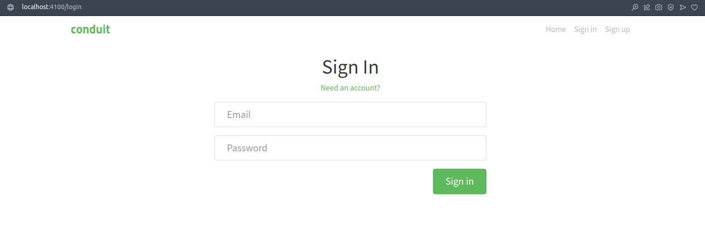
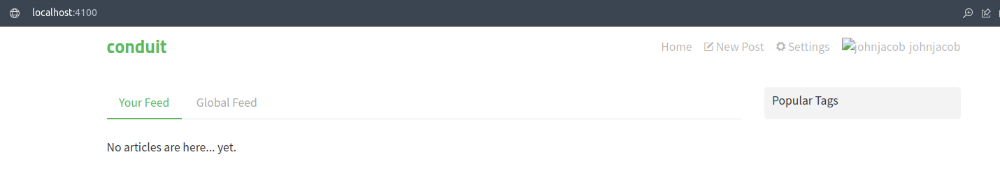

# Frontend

Primeiramente, vamos modificar uma linha de código:

Vá até `conduit/frontend/src/agent.js(L6)` e substitua a url:

De:

```js
const API_ROOT = 'https://conduit.productionready.io/api';
```

Para:

```js
const API_ROOT = 'http://localhost:3000/api';
```

Dessa forma, garantimos que a aplicação esteja comunicando com nossa api (e banco) locais.

## Verificando Login

Caso você tenha realizado os passos do [capítulo anterior](./1_Backend.md), o usuário ja foi criado; portanto, basta acessar a página de [login](http://localhost:4100/login):



E inserir as credenciais

> email: john@jacob.com <br /> password: johnnyjacob

Você deve ser redirecionado para pagina inicial:


