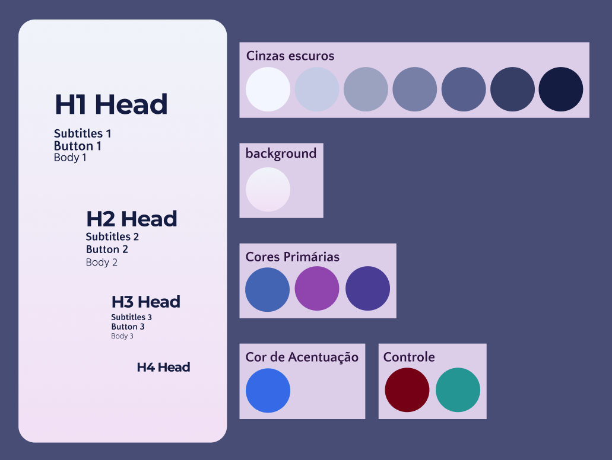
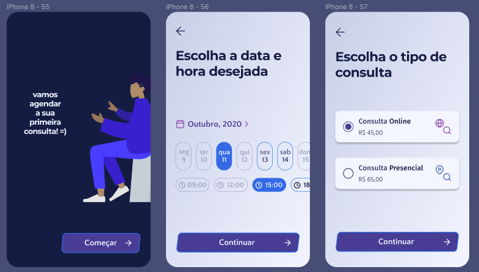
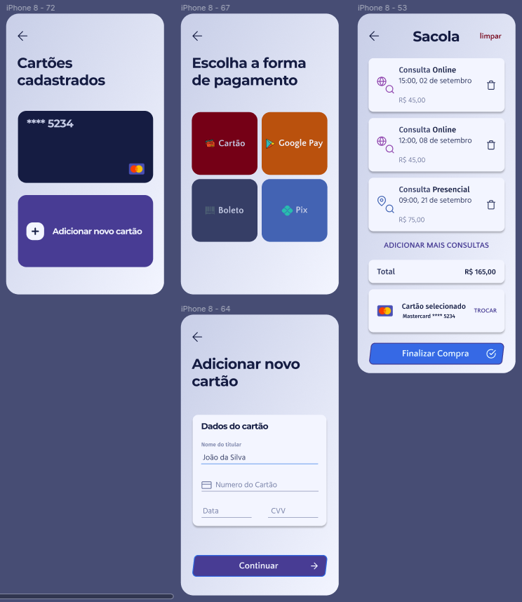
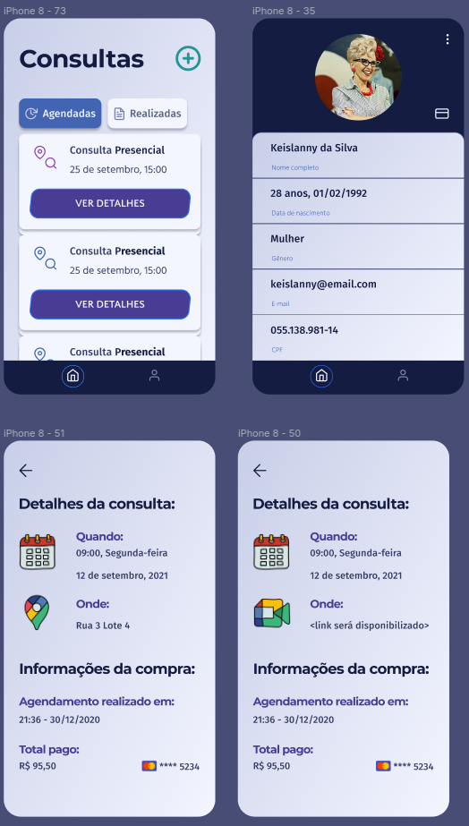

# Resumão Documentação

Nesse capítulo você terá um resumo sobre a importância de um repositório para guardar informações, digamos, mais 'técnica' sobre o desenvolvimento de um projeto.

- [Resumão Documentação]()
  - [Explicação](#explicação)
  - [Docs Appointment](#Docs-Appointment)
    - [Licença](#Licença)
    - [Use Cases](#Use-Cases)
    - [DB - Data Base](#DB---Data-Base)
    

## Explicação

Independente do quão grande um projeto *Open Source* pode ser, é sempre importante manter todos os passos documentados, até porque, outras pessoas precisam saber o porquê das coisas.

O porquê escolheu essa arquitetura, como fazer para compilar seu código e como utilizar o trabalho que foi feito até aquele momento. Existem vários modelos de documentos que regem esses 'Artefatos', mas o importante mesmo é saber explicar para os outros como utilizar seu produto, e o *README* é um bom lugar para colocar algumas dessas informações como uma breve descrição do nome e o que seu produto faz.

## Docs Appointment

> Acesse aqui o [Repositório](https://github.com/appointment-octopus/docs/).

Embora não tenhamos criado todo o aparato de documentação que geralmente aparece, como documento de visões e de arquitetura (dentre outros,como políticas de *branch* e de *commits*), listamos aqui alguns artefatos produzidos que nos ajudaram a visualizar melhor o que gostaríamos de produzir.

Para conseguirmos ter aquela ideia visual melhor sobre a nossa aplicação, fizemos alguns casos de uso e um protótipo.

#### Licença

Como a maioria dos *Commits* iniciais de um repositório, adicionamos a licença, que é uma espécie de documento contratual que te permite comercializar, editar, distribuir seu software. Embora não vamos entrar em tantos detalhes, é bom saber que existem vários tipos de licença, e com restrições de uso, tanto para utilização como para desenvolvimento, e divergem, então é sempre bom parar um pouco para ler mais sobre algumas, principalmente para saber qual é aquela que melhor se encaixa no contexto do seu produto e/ou organização.

No nosso caso, a escolhida foi *MIT License* que em resumo é: Uma licença que "permite usar, copiar, modificar, mesclar, publicar, distribuir, sublicenciar e / ou vender", sem qualquer restrição.
Então disponibilizamos do jeito que está, qualquer um pode usar, e não tem nenhuma garantia nossa em cima do que foi produzido.

### Use Cases

Pode visualizar os casos de uso [aqui](https://github.com/appointment-octopus/docs/tree/main/use_cases).

Tanto os casos de uso como o protótipo caminharam juntos na sua estruturação, já que os casos de uso eram para saber tudo o que um usuário poderia fazer e como ele o faria dentro da plataforma, desde coisas simples, mas que foram descritas, como:

    - *logar* na aplicação
    - escolher uma consulta;
    - adicionar um cartão;
    - adicionar um método de pagamento;

Enquanto obtínhamos essas descrições, íamos colocando esses elementos em um protótipo
    - efetuar a compra;

### Protótipo

Pode acessar o protótipo [aqui](https://www.figma.com/file/jvLCps7aAuxsvHVv1j9x7D/Appointment-Octopus?node-id=0%3A1).

#### Paleta de Cores + Tipografia

A parte principal.

Com isso construímos todas as telas de forma consistente.

Via de regra, as telas são compostas de: 60% cor básica + 30% cor primária + 10% cor de acentuação

As cores primárias são a maior identidade visual da sua aplicação, as cores básicas são utilizadas para background e/ou texto (escala de cinzas) e, por fim, a cor de acentuação é utilizada para destacar algo relevante (normalmente alguma ação)

Por fim, as cores de controle são padrões universais (ex: verde = sucesso, vermelho = falha/perigo, etc)

#### Telas do usuário

### DB - Data Base

Pode visualizar as especificações do banco de dados [aqui](https://github.com/appointment-octopus/docs/tree/main/db).

Nosso Banco de dados, uma das nossas primeiras tomadas de decisão foi tentar entender como seria o comportamento entre os nossos serviços, sendo assim, quais seriam os dados que de cada um iria guardar e quais dados seriam manipuladaos por cada um.

Depois de esquematizarmos quiais seriam todas as "Entidades", que nada mais são do que estruturas com mais de uma informação importante para se guardar,  nosso *MER* (Modelo Entidade Relacionamento) esquematizamos um modelo lógico e conceitual de como seria o nosso banco.

> Caso queiram saber, utilizamos o BrModelo para auxiliar na criação desses modelos, o MER e o diagrama Lógico de bancos.

Esses passos nada mais são que etapas para execução de uma modelagem de um tradicional banco de dados. Logo após essa modelagem levantamos scripts em *SQL* para criação e população de dados nesse banco, basicamente para saber se a modelagem foi realizada com êxito.
