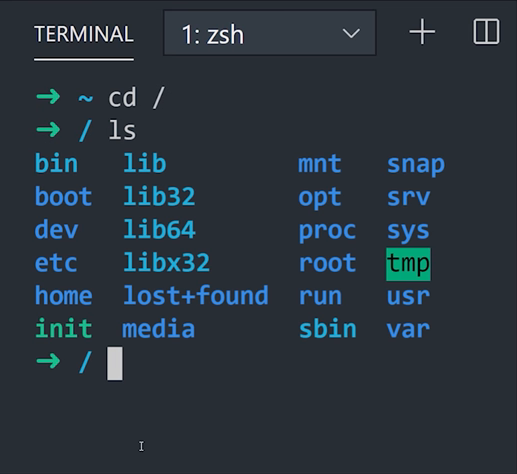

# Terminal

Por não possuir uma interface gráfica, a primeiro contato pode ser intimidador, mas é essencial saber ao menos o básico do terminal para interagir de forma mais prática com seu computador. Neste tópico vamos ensinar e explicar alguns comandos simples, que, no primeiro momento, vão ser de grande ajuda para iniciantes no assunto.

<!-- (imagem ou logo do terminal?) -->

Experimente abrir o terminal e vamos fazer algumas experimentações;

No windows você tinha um gerenciador de tarefas, uma interface que te mostrava como funcionava a estrutura da organização dos seus arquivos, assim podendo entrar e sair de pastas, e acessar esses arquivos, executar, abrir, editar...

> A primeira vista vai reparar no símbolo `~` no começo da primeira linha, basicamente é uma abreviação para a sua pasta home no terminal.

### Diretórios

Com o terminal aberto, utilize o comando `cd` (change directory) para alterar o diretório atual, com o acréssimo de `/` você pode acessar os arquivos de sistema do seu computador, então no seu terminal, experimente: 

```bash
$ cd /
```

> Bem nesse ponto haverá um símbolo `~$` no começo do seu terminal, indicando uma nova linha de comando, a frente do sinal de `$` será o local onde há de ser inserido novos comandos, ao entrar em novas pastas/diretórios `/` a frente do sinal de `~` indicando qual a pasta em que você se encontra no momento.

Agora escreva `ls` (list contents) para poder listar pastas e arquivos dentro daquele diretório. Então dentro da pasta `/` experimente usar `ls`:

```bash
$ ls
```



Nesse ponto você pode por exemplo tentar entrar em uma pasta dentro dessa pasta utilizando `cd` ali acima, junto com o nome de uma pasta presente dentro daquele diretório (que você acabou de ver usando o `ls`).

```bash
$ cd bin
```

Experimente mais uma vez listar os arquivos dentro desse outro diretório.

> O diretório /bin contém os comandos binários essenciais (programas) que devem estar presentes quando o sistema é montado no modo para usuário único. Os aplicativos (como o Chrome, ) são armazenados em /usr/bin, enquanto os programas importantes do sistema e utilitários, como o shell bash, ficam localizados em /bin.
O diretório /urs pode ser armazenado em outra partição. Por isso, colocar esses arquivos no diretório /bin garante que o sistema terá os programas mais importantes, mesmo se não houver outros sistemas de arquivos montados. O diretório /sbin é semelhante, pois ele contém os arquivos binários para a administração do sistema.

<!-- Não sei se deveria colocar um capítulo separado para diretórios, e falar mais de outros comandos no terminal -->

Bem, sabendo que, independente do seu sistema operacional as pastas do seu computador se comportam como uma árvore, e possuem uma certa hierarquia quanto a sua importância. Isso acontece para que haja uma certa segurança quando formos manipular alguns arquivos. Já que os programas mais importantes para o funcionamento estão no **root** do computador, e uma de suas ramificações é responsável pelas aplicações instaladas pelo usuário, sendo a nossa **usr/bin**.

Além da pasta **bin** que guarda arquivos binários para execução na **root**, vamos citar alguns outros que provavelmente vai se deparar com eles e se perguntar, sua função ou necessidade, até porque eles também estão consumindo uma parte da "memória" do seu computador.

**/sbin:** Da mesma forma que a bin, a sbin são conjuntos de executáveis do sistema que cuidam de configurações como a segurança do computador por exemplo. É responsável por pedir credenciais ou permissão de um adm quando for instalar algum programa por exemplo.

**/boot:** Se chegou a fazer o processo de dual boot, já tem uma ideia do que é guardado aqui dentro. Bem basicamente é tudo que o seu computador precisa para poder iniciar o seu Linux corretamente.

**/dev:** Como uma abreviação para *developers*, nessa pasta estão guardadas os arquivos responsáveis pelas configurações de desenvolvedores, no geral a conversa que ocorre entre hardwares como o seu teclado, mouse, câmera, com outras partes do seu computador.

**/etc:** Guarda também um conjunto de instruções que podem ser configuradas por texto, são tão importantes quanto os arquivos contidos em dev, entretanto podem ser simplesmente serem editados em um editor de texto do seu computador.
<!-- talvez falar melhor ou um pouco mais -->

**/home:** Por default, praticamente sempre que abre o seu terminal começa nessa pasta, então funciona quase como o desktop do seu windows.

**/lib(32 e 64):** É onde as aplicações guardam arquivos ao se instalarem. Serão armazedos arquivos binários como em bin e sbin.

**/media e /mnt:** São diretórios em que você pode montar um dispositivo físico, como CD-ROM, partição do seu HD, um pendrive etc.

### Executáveis

São os arquivos binários que execumatos ao utilizar um `.` antes do arquivo, algo como `./nomedoarquivo`.

Já que temos várias pastas para guardar arquivos, e nem sempre sabemos onde foi parar aquele executável... Bem, dá para adotar algumas estratégias de como podemos agir a partir daqui. 
Uma forma interessante de fazer com que o Linux mapeie arquivos executáveis a partir de uma pasta é utilizar o comando `echo $PATH`.

```bash
$ echo $PATH
```
Isso fará com que seja listado os PATH (que é aquele 'caminho' da 'URL') de onde possuem pastas com executáveis.

Caso queira saber onde contém um binário específico:

```bash
$ which curl
```
Onde `which` é a abreviação de Which binary is this, e `curl` o executável que estamos procurando. O retorno vai ser o PATH desse executável.

#### Instalando um software

Você também pode usar o terminal para instalar programas facilmente. Isso é especialmente útil se o software não está iniciando a instalação sozinho ou se você só quer agilizar o processo.

Para fazer isso, digite o comando `sudo apt-get install nome` e substitua o “nome” que colocamos no exemplo pelo nome do programa que você quer instalar. Em seguida, é só apertar o “Enter”.

```bash
$ sudo apt-get install nome
```

### + Comandos

##### sudo: permissões

Por razões de segurança, o Linux trabalha com permissões de usuários. Por isso, determinados comandos ou arquivos são acessíveis apenas pelo próprio dono ou pelo usuário administrador (root). Para que você não tenha que trocar de usuário a todo instante, existe o comando `sudo`, que garante credenciais de usuário root temporariamente, mediante a informação de uma senha (sua senha de usuário do seu Ubuntu).

Para fazer o teste, tente executar o comando:

```bash
$ ls /root
```
Você reberá um aviso de permissão negada. Em seguida, execute:

```bash
$ sudo ls /root
```

Depois de informar a senha do seu próprio usuário (no caso do Ubuntu), o comando será executado normalmente e os arquivos a pasta root serão listados no terminal.

> É equivalente ao executar um programa como administrador no Windows.

##### man: manual dos comandos

O comando `man` é a abreviação de manual, basicamente, se precisar saber todas as coisas referentes aquele comando, experimente utilizar o comando **man** na frente dele adicionar o comando que quer saber sobre.

```bash
$ man ls
```

#### Criar uma pasta naquele diretório

```bash
$ mkdir nome_da_pasta
```

#### Executar um arquivo

```bash
$ ./nome_do_arquivo
```
#### Apagar um arquivo

```bash
$ rm nome_arquivo
```
> caso o arquivo não esteja na pasta em que está no momento, basta colocar o caminho antes do nome.

```bash
$ rm /caminho/nome_arquivo
```

> cada `/` representa um caminho antes de uma pasta

##### cp: copiar

Copiar um arquivo utilizando o terminal é bem simples. Use o comando `cp` seguindo do arquivo de origem e o destino para ele, que pode ser tanto uma nova pasta quanto também um novo arquivo, com nome diferente. Exemplo:

```bash
$ cp arquivo1.txt arquivo2.txt
```
```bash
$ cp arquivo1.txt pastanova/
```

> Caso a intenção seja de copiar um diretório inteiro, basta inserir o parâmetro `-r`. Se quiser clonar uma pasta, use:

```bash
$ cp -r pasta1 pasta2
```

##### cal: calendário

Um simples comando que pode ser usado para abrir o calendário automaticamente é o `cal`.

```bash
$ cal
```

##### cmp: comparar arquivos

Se usar o comando `cmp` e listar dois arquivos em seguida, o terminal se encarregará de compará-los automaticamente.

```bash
$ cmp arquivo1.txt arquivo2.txt
```

##### mv: mover

Para mover arquivos existe o comando `mv` e ele pode ser usado tanto para remanejar arquivos como para renomeá-los. Se quiser enviar o arquivo de uma pasta para outra, basta seguir o exemplo: 

```bash
$ mv pasta1/arquivo1 pasta2/
```

Se preferir apenas renomeá-lo:

```bash
$ mv arquivo1 arquivo2
```

##### more: ler

Caso você precise ler o conteúdo de um arquivo de texto, use o comando `more` seguido do caminho e nome do arquivo:

```bash
$ more /home/user/arquivo.txt
```

Todo conteúdo do arquivo será exibido no terminal, preenchendo a tela com texto. Para prosseguir com a leitura, pressione a barra de espaço e, caso precise voltar uma ou mais páginas, use a tecla "b". Se quiser sair antes do fim do arquivo, pressione "q".
Leitura de texto no Linux com o comando more.

##### df: conferir o espaço em disco

Quer saber qual é o espaço total e quantos GB disponíveis existem em cada partição do sistema? Use o comando `df -h` .

```bash
$ df -h
```
> A opção -h, aliás, quer dizer human-readable, ou seja, legível para humanos. Se você executar o comando sem ela, as informações serão exibidas em kilobytes e será necessário convertê-las mentalmente para outras unidades.

##### free: ver uso de memória

Se quiser dar uma rápida olhada no uso de memória do seu computador, basta abrir o terminal e inserir o comando `free` e apertar a tecla `Enter`. Dessa forma, poderá encontrar aplicações que estão consumindo mais memória, ideal para identificar fontes de problemas.

```bash
$ free
```

##### history: histórico de comandos

Para ter uma visualização dos comandos que você usou no terminal previamente, simplesmente insira o comando `history`.

```bash
$ history
```

##### locate: encontrar arquivos

Para encontrar arquivos no Linux com facilidade, basta inserir o comando `locate` seguido pelo nome dos arquivos que você achar.

```bash
$ locate arquivo1.txt
```

##### grep: buscas em textos

Imagine a seguinte situação: você tem um arquivo .txt com vários nomes de alunos de certa escola, mas não tem certeza se um nome em específico está listado. O grep ajuda você a procurar por esse aluno e a fazer muito mais com a ajuda de expressões regulares.

Bastaria executar o comando: 

```bash
$ grep "Nome do Aluno" arquivo.txt
```

Fará com que o terminal busque pelo nome indicado dentro da relação. 

> Caso você não tenha certeza se o nome do aluno foi escrito respeitando as letras maiúsculas, adicione o parâmetro -i para que grep passe a ignorar essa distinção durante a busca.

##### clear: limpar buffer

Por último, um comando que ajuda a organizar um pouco a confusão de letras que ficam no terminal depois de horas de uso. Para limpar toda a ela, execute o comando `clear`. Depois, é só voltar a usar o terminal normalmente, como se nada tivesse acontecido.

```bash
$ clear
```

> Ou então, pode utilizar o comando `Ctrl + L` para a mesma coisa.

### Atalhos

Alguns atalhos que podem facilitar o manuseio dentro do terminal:

**tab** : Ele irá automaticamente completar o que você estava digitando ou mostrará todos os resultados possíveis.

**Ctrl+L** : Para limpar o terminal.

**Ctrl+A** : Este atalho moverá o cursor para o início da linha. Suponha que você digitou um longo comando ou caminho no terminal e deseja ir para o início dele. Se usar a tecla de seta para mover o cursor levará bastante tempo.

**Ctrl+E** : Esse atalho é oposto ao `Ctrl + A`.  O `Ctrl + A` envia o cursor para o início da linha, enquanto `Ctrl + E` move o cursor para o final da linha.

**Ctrl+C** : Cancela o comando atual em funcionamento.

**Ctrl+Z** : Pausa o comando atual, em primeiro plano ou segundo plano.

**Ctrl+D** : Faz o logout da sessão atual (fecha o terminal).

**Ctrl+W** : Apaga uma palavra na linha atual.

**Ctrl+U** : Apaga a linha inteira.

**Ctrl+K** : Este é semelhante ao atalho `Ctrl + U`. A única diferença é que, em vez do início da linha, ela apaga tudo, da posição atual do cursor até o final da linha.

**Ctrl+Y** : Isto irá colar o texto apagado ao usar os atalhos `Ctrl + W`, `Ctrl + U` e `Ctrl + K`. Útil no caso de você ter apagado o texto errado ou se você precisar usar o texto apagado em outro lugar.

**Ctrl+P** : Você pode usar este atalho para visualizar o comando anterior. Você pode pressioná-lo repetidamente para continuar retornando ao histórico de comandos. Em muitos terminais, o mesmo pode ser alcançado com a tecla PgUp.

**Ctrl+N** : Você pode usar este atalho junto com o `Ctrl + P`. `Ctrl + N` exibe o próximo comando. Portanto, se você estiver visualizando comandos anteriores com `Ctrl + P`, poderá usar `Ctrl + N` para navegar para frente e para trás. Muitos terminais têm esse atalho mapeado para a chave PgDn.

**Ctrl+R** : Busca um comando recente.

**!!** : Repete o último comando.

**exit** : Faz o logout da sessão atual (fecha o terminal).


<!-- Revisão dos comandos e atalhos

ls: Lista diretórios e arquivos

ls -l: Opção lista longa "com detalhes"

ls dir: Lista outro diretório que não o corrente

history: Histórico de comandos

mkdir: Cria Diretórios

rm -r: Remove diretórios com a opção -r

cd dir: Muda o diretório atual para outro

cd /: Muda para o diretório raiz /

cd ~: Muda para o diretório pessoal (home)

cd ..: Retoma ao Diretório Anterior

--help: Exibe o arquivo de ajuda de um comando

man comando: Exibe o manual do comando

mv antigo novo: Renomeia um diretório ou arquivo

mv dir/ ~: Move um diretório para o diretório pessoal

touch nomearquivo: Cria arquivos vazios no Linux

cp arquivo diretório: Faz uma cópia de um arquivo para outro diretório

rmdir: Específico para remover diretórios

rm nomearquivo: Remove um arquivo

clear: Limpa o terminal

exit: Finaliza sessão do terminal -->


<!-- https://www.youtube.com/watch?v=42iQKuQodW4 -->
<!-- https://www.apptuts.net/tutorial/web/comandos-uteis-terminal-linux/ -->
<!-- https://canaltech.com.br/linux/10-comandos-essenciais-do-linux/ -->
<!-- https://digitalinnovation.one/artigos/fundamentos-comandos-e-atalhos-linux -->