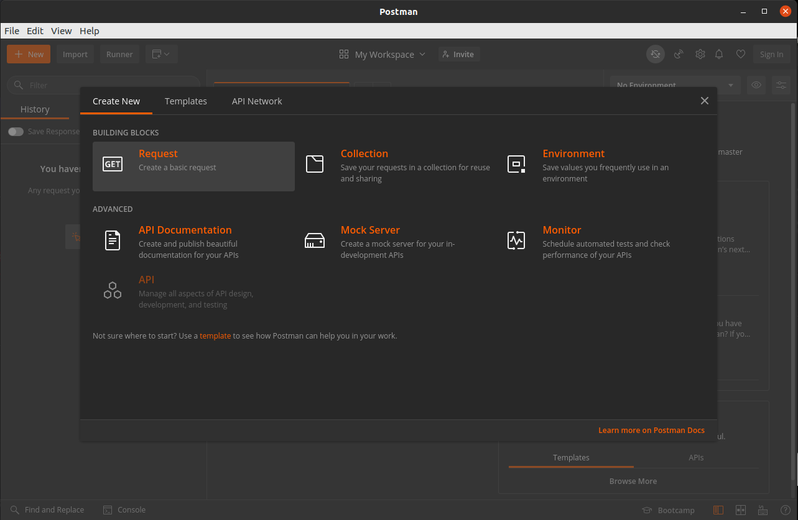
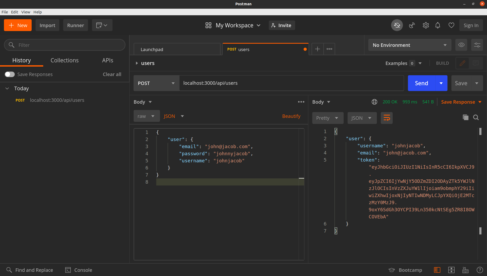
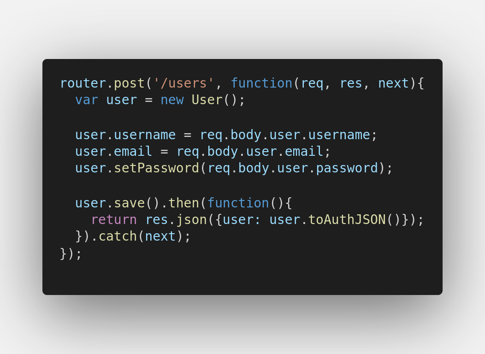
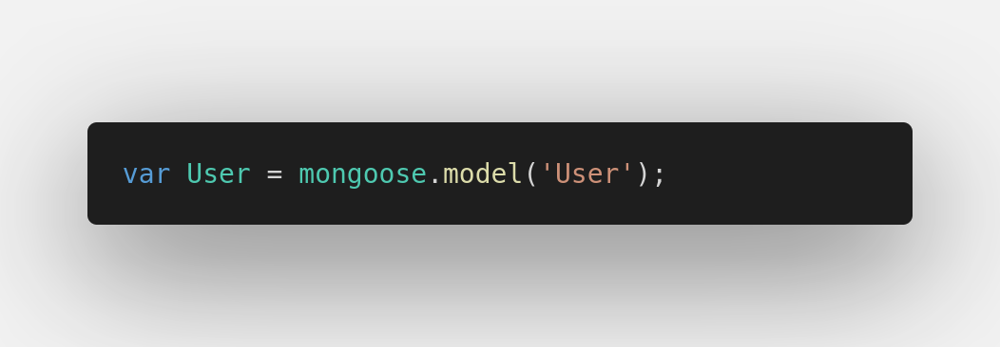
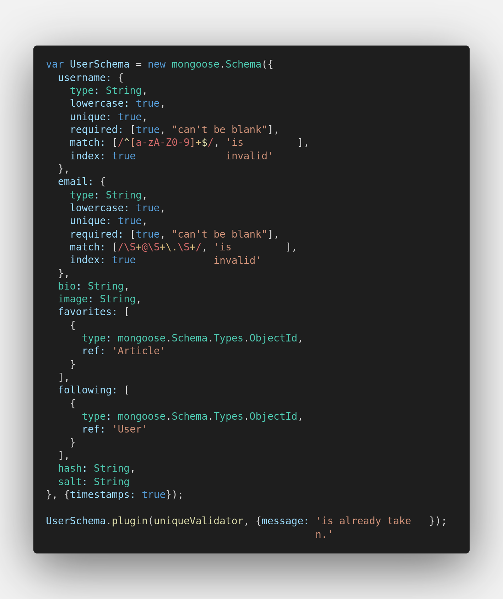
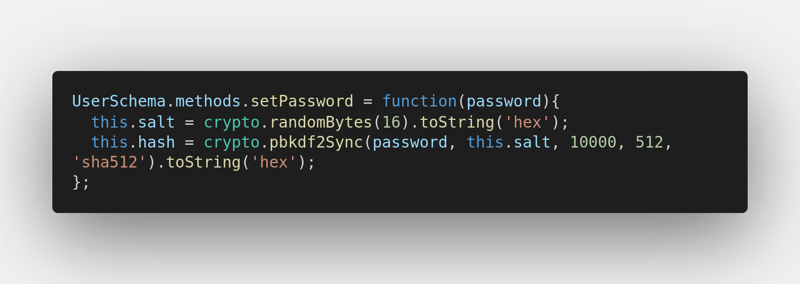
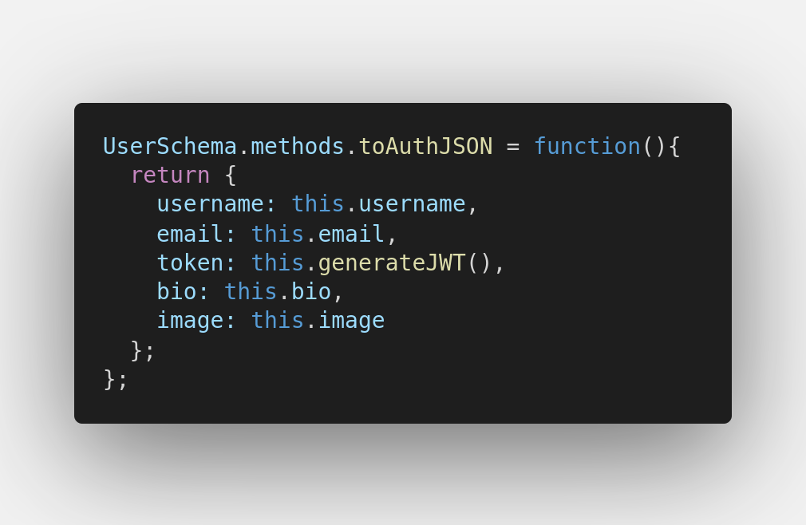

# Backend

Para interagir com o backend, em geral, é mais indicado utilizar [Postman](https://www.postman.com/) ou [Insomnia](https://insomnia.rest/)

Ambas as ferramentas são utilizadas para fazer requisições http; dessa forma, para testar alguma rota especifica do backend, não será necessário, por exemplo, navegar nas telas do frontend até chegar no botão X que faz uma requisição especifica em alguma rota do backend.
Não é necessário, também, ir ao mais "baixo nível" que seria utilizando o comando `curl` e afins.

Exemplificando:

1. Crie um novo **request** no Postman


2. Preencha as informações:
```
url = https://localhost:3000/api/users/
tipo = POST
body = raw, json
```
```json
{
    "user": {
        "email": "john@jacob.com",
        "password": "johnnyjacob",
        "username": "johnjacob"
    }
}
```



Para entender melhor esse request, vamos verificar como está especificada a criação de usuários no backend.

Abra `backend/routes/api/users.js(L63-73)`:


Perceba que `user` é uma instância da model `User`:
Em `backend/routes/api/users.js(L4)`


Para entendermos o que é essa model,

Abra `backend/models/Users.js`:

Não precisamos nos aprofundar muito, mas, de acordo com o código visto acima, há 3 trechos relevantes:

Schema:


Set Password:

> é recomendada a pesquisa sobre `pbkdf2`, `bcrypt`, `sha512`, `salt`, `pepper` no contexto de criptografia :)
> mas, basicamente trata-se de uma segurança a mais para armazenar as senhas dos usuários
> dificultando que *hackers* consigam "adivinhar" a senha dos usuários (seja através de *bruteforce* ou de *"ataques rainbow table"*)

To Auth Json:


Com isso tudo, podemos inferir bastante sobre o funcionamento do request que fizemos:
A api recebe nosso request (incluindo o corpo de texto [em formato json] com informações de cadastro do usuário), valida se o `username`, `email` e `password` atendem as especificações do `Schema` (por ex: não podemos cadastrar "abc" como email), a senha é criptografada e, então, o usuário é salvo no banco de dados Mongo;
Caso tudo tenha ocorrido corretamente, o servidor responde o request do usuário mostrando informações básicas de como o usuário foi cadastrado no banco de dados.